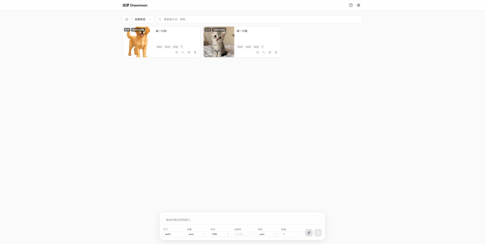
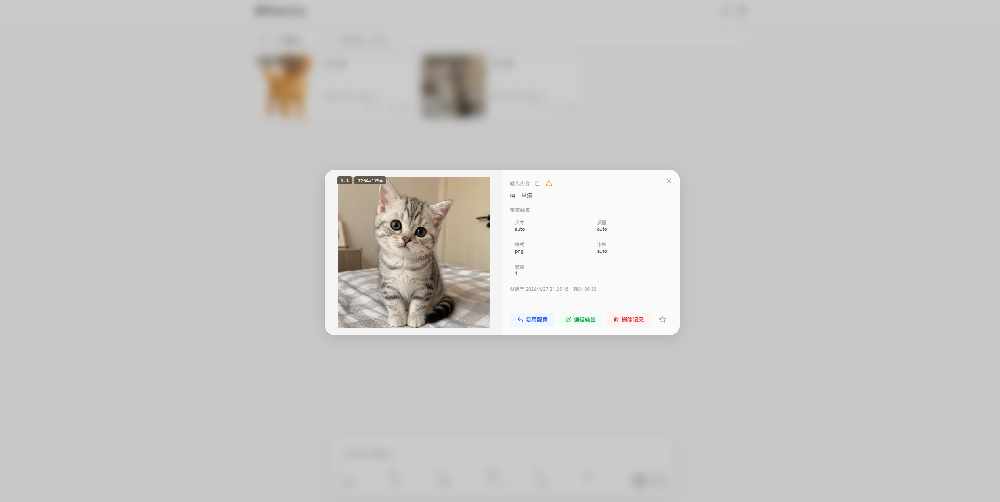
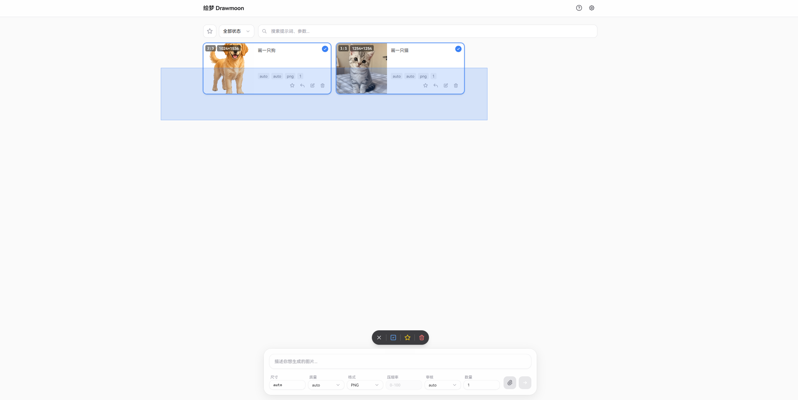
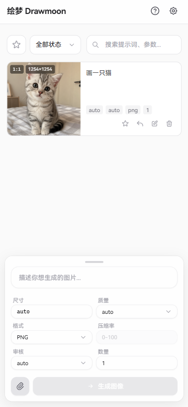
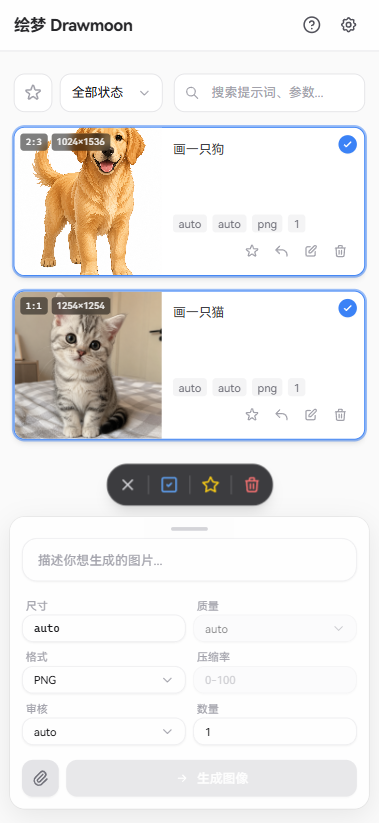

# 绘梦 Drawmoon · 使用教程

一个本地优先（local-first）的 AI 绘画工作台。直接对接 OpenAI 的图像生成接口，把「调参 → 出图 → 整理回溯」这条链路做顺手；所有任务记录、参考图与生成结果都只留在你自己的浏览器里。

> ⚠️ 浏览器对 HTTPS 页面加载 HTTP 资源有限制。若你的 API 节点是裸 HTTP，请把页面部署到能 CORS/HTTPS 通的环境，不要直接放到 `.dev` 这类强制 HTTPS 的域名下。

---

## 📸 界面预览

<div align="center">
  <b>桌面端 — 主界面</b><br>
  
</div>

<br>

<div align="center">
  <b>桌面端 — 任务详情与实际参数对照</b><br>
  
</div>

<br>

<div align="center">
  <b>桌面端 — 拖拽框选与批量操作</b><br>
  
</div>

<br>

<div align="center">
  <b>移动端 — 主界面</b><br>
  
</div>

<br>

<div align="center">
  <b>移动端 — 侧滑多选</b><br>
  
</div>

---

## 🚀 快速开始

1. 打开网页
2. 点击右上角 ⚙️ 设置图标，填入 **API URL** 与 **API Key**
3. 在底部输入框写提示词，点发送 / 按 `Ctrl+Enter`
4. 任务卡出现在主区，生成完成后点开看大图

---

## ✨ 主要能力

### 🔀 双 API 路线，按需切换

| 路线 | 端点 | 适合的模型类型 |
|------|------|----------------|
| **Images API** | `/v1/images/generations`、`/v1/images/edits` | GPT Image 系列图像模型，例如 `gpt-image-2` |
| **Responses API** | `/v1/responses`（通过 `image_generation` 工具调用） | 支持该工具的文本模型，例如 `gpt-5.5` |

切换发生在设置面板，无需重载页面。两条路线都支持纯文生图与参考图编辑。

### 🖼️ 输入与编辑

- 文本提示词出图，单次最多 16 张参考图
- 支持文件选择 / 系统粘贴 / 拖拽三种入图方式
- **迭代生成**：把上一轮的输出图直接送回输入区接着改

### 🎚️ 精细参数面板

- **智能尺寸**：`auto` 或 `1K / 2K / 4K × 常用比例` 自动算出宽高，也可以直接手填
- **自动规整**：自定义尺寸会按模型限制对齐到合法区间 —— 宽高均为 16 的倍数、最长边 ≤ 3840px、宽高比 ≤ 3:1、总像素 ∈ [655360, 8294400]
- **预设反推**：打开尺寸弹窗时自动匹配最接近的预设比例
- 质量 / 输出格式（PNG · JPEG · WebP）/ 压缩率（0–100）/ 审核强度（auto · low）
- **实际参数追踪**：API 返回的实际尺寸 / 质量 / 格式 / 数量与你的请求值不一致时会高亮标记

### 📚 历史记录与工作流

- **瀑布流卡片**：缩略图 + 提示词 + 参数 + 耗时一屏可见
- **筛选与搜索**：按状态、关键词、收藏与否过滤
- **多选批量**：桌面端拖框 / Ctrl-⌘ 点选；移动端左右侧滑选择；批量收藏 / 删除 / 全选当前可见
- **一键复用**：把任意历史记录的提示词与参数回填到输入框
- **画廊与详情**：点开任务卡浏览大图与完整参数对照
- **快捷菜单**：图片右键或长按弹出操作菜单，支持复制 / 下载

### 📱 多端体验

- 响应式布局，桌面端和移动端各自独立优化交互
- PWA 支持，可作为独立应用安装到桌面或主屏

### 💾 全本地数据

- 任务记录与图片直接存进浏览器 IndexedDB —— **数据从不离开本机**
- 内存缓存 + 延迟写入；图片按 SHA-256 自动去重；启动时清扫孤立碎片
- API Key 在本机用 AES-GCM 混淆存储（注意：这只是基础保护，不是密码学意义的加密；公用电脑请慎用）
- **ZIP 导入 / 导出**：导出包内是原始图片文件 + `manifest.json` 元数据，方便迁移与备份

### 🔌 Codex CLI 兼容模式

如果你接的是源于 Codex CLI 的 API（典型特征是 `quality` 字段失效、提示词被改写、`n` 不生效），可在设置里开启该模式：

- 自动屏蔽 `quality` 参数，前端 UI 同步固定为 `auto`
- Images API 的多图生成改用并发单图请求，绕过 `n` 失效问题
- 提示词前自动追加一段「按原文使用，不要改写」的简短指令
- 应用检测到提示词被改写或返回字段缺失时会主动提示是否开启该模式

---

## 🛠️ API 配置详解

点击右上角的设置图标可随时调整：

- **Images API**：调用 `/v1/images/generations` 与 `/v1/images/edits`，模型填 GPT Image 系列，例如 `gpt-image-2`
- **Responses API**：调用 `/v1/responses` 并使用 `image_generation` 工具，模型填支持工具调用的文本模型，例如 `gpt-5.5`
- **Codex CLI 模式**：开启后不再发送 `quality`，UI 中的质量选项固定 `auto`；提示词加不改写前缀；Images API 多图改用并发请求
- 当应用检测到提示词被改写时，会询问是否为当前 `API URL + API Key` 组合开启 Codex CLI 模式（取消后该组合不再重复询问）

### 🔗 URL 查询参数

可通过 URL 参数预填配置，便于做成书签或分享：

| 参数 | 说明 | 默认 |
|------|------|------|
| `apiUrl` | API 端点 | 无 |
| `apiKey` | API Key | 无 |
| `apiMode` | `images` 或 `responses` | `images` |
| `codexCli` | `true` 或 `false` | `false` |

示例：

```
https://img.jidog.com/?apiUrl={address}&apiKey={key}
```

打开后参数会被立刻写入设置并从地址栏中移除，避免 key 残留在浏览历史里。

---

## ⌨️ 快捷键与手势

### 桌面端

| 操作 | 快捷键 |
|------|--------|
| 提交任务 | `Ctrl+Enter` / `⌘+Enter` |
| 关闭弹窗 | `Esc` |
| 大图左右切换 | `←` / `→` |
| 大图缩放 | 滚轮 / 双击 |
| 多选 | 空白处拖框 / `Ctrl-⌘` 点击卡片 |
| 取消选择 | 点空白 / `Esc` |
| 图片菜单 | 右键 |

### 移动端

| 操作 | 手势 |
|------|------|
| 选择卡片 | 在卡片上左右滑 |
| 大图缩放 | 双指捏合 / 双击 |
| 大图切换 | 左右滑 |
| 图片菜单 | 长按 |
| 折叠/展开输入区 | 拖动顶部把手 |

---

## 💾 数据导入导出

设置 → 数据管理：

- **导出**：把所有任务、图片、当前 API 设置打包为 `drawmoon-{timestamp}.zip`，包含原始图片文件 + `manifest.json` 元数据
- **导入**：选择此前导出的 ZIP，会**合并**到当前数据中（已存在的 id 会被覆盖）
- **清空**：删除全部本地数据并重置设置（**不可恢复**）

---

## ❓ 常见问题

**Q：API Key 安全吗？**
A：填入的 Key 用 AES-GCM 在本机浏览器混淆存储，加密 key 单独放在 IndexedDB（与主数据库隔离）。这能挡住浏览器扩展批量扫描和共享屏幕路过查看，但**不是密码学意义的加密**——决心攻击者仍能拿到。公用电脑请用完后在「数据管理」里清空。

**Q：换浏览器/换设备数据会同步吗？**
A：不会。所有数据在 IndexedDB 里，只属于当前浏览器。要迁移用「导出 ZIP → 在新设备导入」。

**Q：图片很多会卡吗？**
A：任务卡片走视口懒加载，图片缓存有上限自动回收，几百张记录不会卡。但如果保留几千条记录又频繁开详情视图，浏览器内存可能上 GB。需要时去清空一下。

**Q：刷新页面后正在生成的任务会怎样？**
A：会被标记为「任务被中断（页面已刷新或关闭）」，不会再显示转圈。可以点开看到错误，再用「复用配置」重发一次。

**Q：能离线使用吗？**
A：部署后第一次访问会缓存到本地，之后断网仍能打开界面（PWA）。但生成图片需要访问 API，离线时只能查看历史记录。
